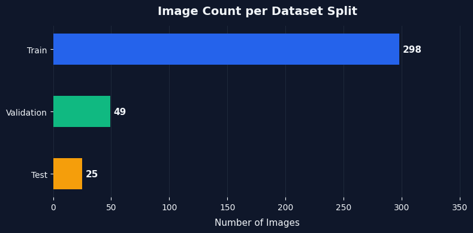
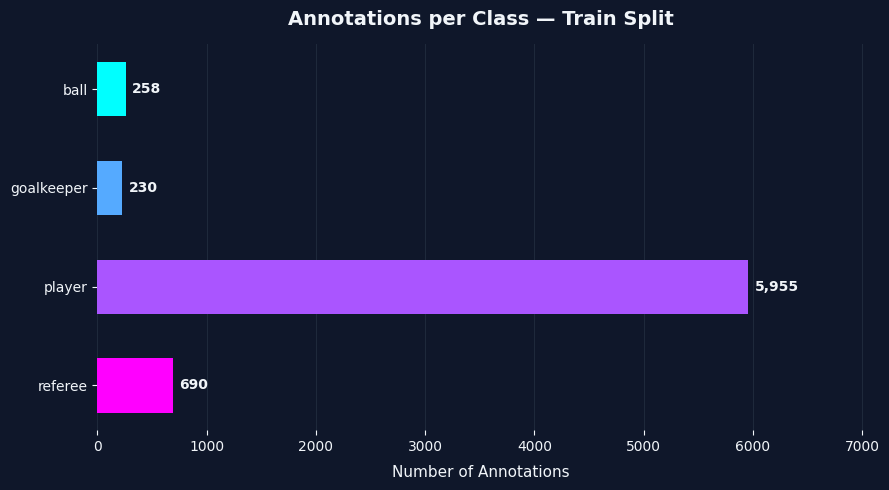
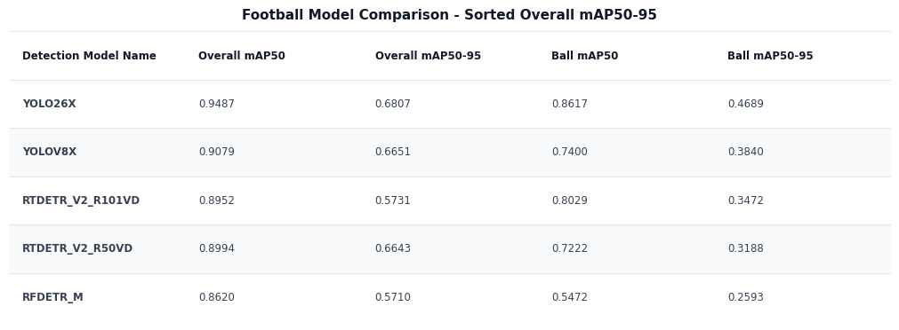

# ⚽ 2026 Football Detection

[![JupyterNotebook][JupyterNotebook]][JupyterNotebook-url]
[![PyTorch][PyTorch]][PyTorch-url]
[![HuggingFace][HuggingFace]][HuggingFace-url]
[![Roboflow][Roboflow]][Roboflow-url]

A comparison of the latest state-of-the-art real-time object detection models on a **small** football player detection dataset consisting of **297** annotated training samples. Using the findings of this respository for a foundation, users can rapidly build a full-fledged football analysis systems with minimal, manual annotations.

<div align="center">
  
  <p><em>YOLO26x's performance on the video sample #5.</em></p>
</div>

After training, **Yolo26X** achieved the best performance with a **mAP50:95 score of 0.6807** across all four classes (balls, goalkeepers, players, and referees) and a **mAP50:95 score of 0.4689** for specifically the ball class.

## 🤖 Models compared
- [YOLOv8x](https://docs.ultralytics.com/models/yolo26/) (CNN-based, 68.2M parameters)
- [YOLOv26x](https://docs.ultralytics.com/models/yolo26/) (CNN-based, 55.7M parameters)
- [RT-DETRv2](https://huggingface.co/docs/transformers/model_doc/rt_detr_v2) (Transformer-based, 43M and 76.8M  parameters)
- [RF-DETR Medium](https://rfdetr.roboflow.com/latest/) (Transformer-based, 33.7M parameters)

## 🗄️ Data
🏷️ **Training, Validation, Test Data**

<div align="center">
  
  
</div>

A small, yet high-quality dataset was used for training, validation, and testing, so that users with limited hardware could achieve desired results in a short amount of time. The data was hand-annotated for models to detect: **balls, goalkeepers, players, and referees**.

While larger datasets do exist for football detection purposes, their annotations may not always be correct, thus a small, high-quality dataset was selected with the league of interest being the **Bundesliga**.

- [Bundesliga Football Detection Dataset](https://app.roboflow.com/toms-workspace-wdism/football-players-detection-3zvbc-pdokb/browse?queryText&pageSize=50&startingIndex=0&browseQuery=true) (Image Size : 1280x1280)

🎥 **Sample Videos**

To see how the models perform, **5** sample videos depicting **Bundesliga** play can be used.
- [Sample 1 ~ 0bfacc_0.mp4](https://drive.google.com/uc?id=12TqauVZ9tLAv8kWxTTBFWtgt2hNQ4_ZF) 
- [Sample 2 ~ 2e57b9_0.mp4](https://drive.google.com/uc?id=19PGw55V8aA6GZu5-Aac5_9mCy3fNxmEf)
- [Sample 3 ~ 08fd33_0.mp4](https://drive.google.com/uc?id=1OG8K6wqUw9t7lp9ms1M48DxRhwTYciK-)
- [Sample 4 ~ 573e61_0.mp4](https://drive.google.com/uc?id=1yYPKuXbHsCxqjA9G-S6aeR2Kcnos8RPU)
- [Sample 5 ~ 121364_0.mp4](https://drive.google.com/uc?id=1vVwjW1dE1drIdd4ZSILfbCGPD4weoNiu)

Samples can be downloaded like so:
```
!pip install gdown
!gdown -O "0bfacc_0.mp4" "https://drive.google.com/uc?id=12TqauVZ9tLAv8kWxTTBFWtgt2hNQ4_ZF"
!gdown -O "2e57b9_0.mp4" "https://drive.google.com/uc?id=19PGw55V8aA6GZu5-Aac5_9mCy3fNxmEf"
!gdown -O "08fd33_0.mp4" "https://drive.google.com/uc?id=1OG8K6wqUw9t7lp9ms1M48DxRhwTYciK-"
!gdown -O "573e61_0.mp4" "https://drive.google.com/uc?id=1yYPKuXbHsCxqjA9G-S6aeR2Kcnos8RPU"
!gdown -O "121364_0.mp4" "https://drive.google.com/uc?id=1vVwjW1dE1drIdd4ZSILfbCGPD4weoNiu"
```


## 📊 Results

<div align="center">
  
</div>

Model Training Parameters were kept similar to provide fair comparison. Detection models were trained:
- On **150** Epochs, with early stopping (25 for transformer-based models and 50 for CNN-based models)
- Using the **same training data augmentations** (to prevent overfitting and add training variety)
- With the **highest resolution size possible** depending on the model and hardware (1280x1280)

Evaluations performed at **0.3** confidence.

**Yolo26X** achieved the best performance with a **mAP50:95 score of 0.6807** across all four classes: **balls, goalkeepers, players, and referees**. With footballs being the smallest object, and most difficult to detect, models were additionally evaluated using only the mAP50:95 metric for this particular class. Still, **Yolo26X** outperformed other models when only looking at **footballs**.

**Additional Finding**
- Models don't generalize that well since each football league can use differenet colored referee jerseys and balls. This can even change from one season to the next for a particular league.
- More data doesn't always yield better results. Detection models were trained using much large datasets (2000 training samples), but would have lower mAP scores and worse performance. This is attributed to poor data annotations, as some datasets used pre-trained models for annotations rather than hand annotations. In some cases, balls would not be annotated correctly.
- Default augmentations for the Yolo models prove better than custom tailored augmentations.

### ⚙️ Environment Used
- Ubuntu 24.04.4 LTS
- [ROCm 7.2.0](https://rocm.docs.amd.com/projects/install-on-linux/en/docs-7.2.0/install/3rd-party/pytorch-install.html) 
- [AMD Radeon RX 7800XT 16GB](https://de.pcpartpicker.com/product/N4P8TW/sapphire-nitro-radeon-rx-7800-xt-16-gb-video-card-11330-01-20g)

## 🏗️ Repository Structure

```
📦 project-root/
├── 📂 analysis/        # Analyzing datasets, model performance, and active learning
├── 📂 data/            # Model training data and samples
├── 📂 documentation/   # Project README
├── 📂 models/          # Trained model storage
├── 📂 pipelines/       # Training, evaluation, and data processing pipelines
├── 📂 results/         # Model performance on video samples
└── 📂 utils/           # Shared utility functions
```

## 🚀 Getting started
- If using ROCm, create the necessary docker container followng the instructions from [here](https://rocm.docs.amd.com/projects/install-on-linux/en/docs-7.2.0/install/3rd-party/pytorch-install.html).
- Clone the respository ```git clone ```
- Install requirements ```pip install requirements.txt```

## 🔮 Next Steps
This repository lays the foundations for a strong football analysis system, but for next steps users could:
- Create larger detection datasets using a fine-tuned detection model
- Apply active learning and only annotate samples using the images the fine-tuned detection model is most undertain about
- Train a keypoint detecton model and use homography, to determine real world coordinates of detections
- Start applying anaysis functions to gather match statistics like possession, player heatmaps, etc. 

<!-- MARKDOWN LINKS & IMAGES -->
<!-- https://www.markdownguide.org/basic-syntax/#reference-style-links -->
[JupyterNotebook]: https://img.shields.io/badge/Jupyter_Notebook-F37626?style=for-the-badge&logo=jupyter&logoColor=white
[JupyterNotebook-url]: https://jupyter.org/
[PyTorch]: https://img.shields.io/badge/PyTorch-EE4C2C?style=for-the-badge&logo=pytorch&logoColor=white
[PyTorch-url]: https://pytorch.org/
[HuggingFace]: https://img.shields.io/badge/Hugging_Face-FFD21E?style=for-the-badge&logo=huggingface&logoColor=black
[HuggingFace-url]: https://huggingface.co/
[Roboflow]: https://img.shields.io/badge/Roboflow-6706CE?style=for-the-badge&logo=roboflow&logoColor=white
[Roboflow-url]: https://roboflow.com/